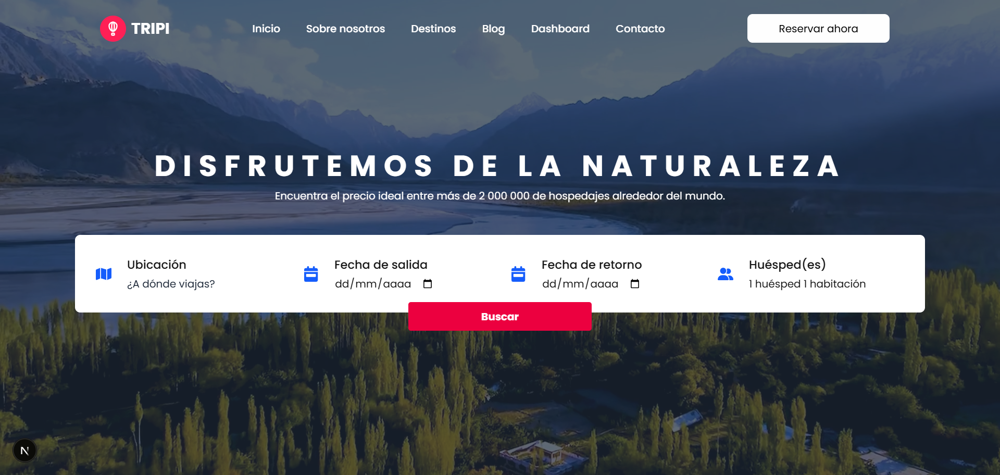

# 🧳 TRIPI TRAVEL ✈️

[](https://tripi-travel-web.netlify.app/)

Bienvenido a **Tripi Travel**, tu plataforma ideal para encontrar alojamientos al mejor precio, con una experiencia moderna, rápida y centrada en tu comodidad. Nos especializamos en hacer que tus viajes comiencen desde el primer clic, conectándote con espacios acogedores y un servicio personalizado las 24 horas. Accede desde cualquier dispositivo y prepárate para descubrir una forma más inteligente y cómoda de viajar. ¡Explora, reserva y viaja con confianza gracias a Tripi Travel!

---

## 🌟 **Características Principales**

- 💻 **Amplio catálogo de alojamientos**, con opciones recientes, populares y altamente calificadas.
- 🎨 **Estética limpia y amigable**, diseñada para que navegar y encontrar tu destino ideal sea intuitivo.
- 📱 **Adaptabilidad total**, la interfaz se ajusta perfectamente a móviles, tablets y computadoras.
- ✨ **Efectos visuales sutiles y agradables**, que mejoran la interacción sin distraer al usuario.
- 🗺️ **Vista previa de cada alojamiento con imágenes destacadas**, que te ayudan a elegir mejor tu próximo viaje.
- 🚀 **Carga veloz y optimización SEO**, aprovechando el poder de Next.js para mejorar visibilidad y experiencia.

---

## ❓ ¿Por qué se llama Tripi Travel?

El nombre **Tripi Travel** nace de la idea de hacer tus **viajes más fáciles, accesibles y placenteros**. "Tripi" transmite familiaridad y cercanía, como si viajar fuera tan simple como una conversación entre amigos.

Queremos que cada reserva y cada destino signifiquen algo especial. Por eso, **Tripi Travel no solo te conecta con lugares, sino con experiencias únicas** pensadas para tu bienestar.

---

## 🛠️ Tecnologías Utilizadas 👨‍💻

| HTML | CSS | JavaScript | React | TypeScript | Tailwind CSS | Next.js | Node.js | ESLint |
|------|-----|------------|--------|-------------|---------------|--------|---------|--------|
|  |  |  |  |  |  |  |  |  |

---

## 🚀 Instalación y Uso Local

Sigue estos pasos para clonar y ejecutar el proyecto en tu máquina local:

1. **Clona el repositorio:**

   ```bash
   git clone https://github.com/carlozzsilva10/tripi-travel.git
   ```

2. **Entra en el directorio del proyecto:**

   ```bash
   cd event-horizont
   ```

3. **Instala las dependencias necesarias:**

   ```bash
   npm install
   ```

4. **Ejecuta la aplicación en entorno de desarrollo:**

   ```bash
   npm run dev
   ```

5. **Abre tu navegador y visita:**

   ```bash
   http://localhost:3000
   ```

---

## 📩 Contacto

Si tienes alguna pregunta o sugerencia, puedes encontrarme en:

- 🌐 [Mi GitHub](https://github.com/carlozzsilva10)
- 📧 Email: [carlos.esilva1007@gmail.com](mailto:carlos.esilva1007@gmail.com)
- 💼 [Mi LinkedIn](https://www.linkedin.com/in/carlos-eduardo-silva-bustamante-b6084528b?utm_source=share&utm_campaign=share_via&utm_content=profile&utm_medium=android_app)

---

Te invitamos a descubrir todo lo que **Tripi Travel** ofrece para hacer tus viajes más fáciles y placenteros.